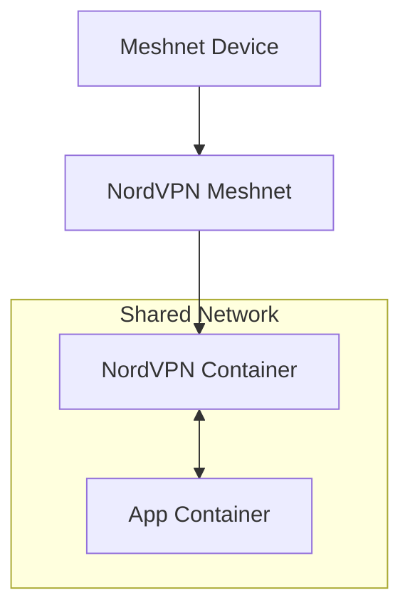

<h1>
  NordVPN Docker Gateway
  <a href="https://github.com/colvdv/nordvpn-docker-gateway/stargazers">
    
  </a>
</h1>

[](https://github.com/colvdv/nordvpn-docker-gateway/commits)
[](https://github.com/colvdv/nordvpn-docker-gateway/blob/main/Dockerfile)
[](https://github.com/colvdv/nordvpn-docker-gateway/blob/main/LICENSE)
[](https://app.codacy.com/gh/colvdv/nordvpn-docker-gateway/dashboard?utm_source=gh&utm_medium=referral&utm_content=&utm_campaign=Badge_grade)
[](https://www.codefactor.io/repository/github/colvdv/nordvpn-docker-gateway)
<br>
[](https://github.com/colvdv/nordvpn-docker-gateway/releases)
[](https://github.com/NordSecurity/nordvpn-linux/releases)
[](https://github.com/colvdv/nordvpn-docker-gateway/actions/workflows/docker-image.yml)

## **Route any Docker Container through the official NordVPN Linux Client in a Custom Docker Image (with Meshnet access) without 3rd-Party Tools or Exposing LAN**

> [!NOTE]
> This is an unofficial community project utilizing the official NordVPN Linux client.

<br>

# ❔ Why this project?
 - **🚫 Third-Party Bloat:** Most online tutorials rely solely on third-party images (Gluetun, Bubuntux, etc.). This guide uses the official NordVPN Linux client built into a custom image that you can build yourself. *It’s cleaner, more secure, and utilizes Meshnet for effortless remote access without opening router ports.*
 - **🔒 Security Sandbox:** Since the [NordVPN client on Linux currently requires local network access to be enabled in order for Meshnet peers to be able to access Docker containers](https://meshnet.nordvpn.com/troubleshooting/linux#cannot-access-docker-containers-over-meshnet), this is a solution that works around that so that you don't have to expose your entire machine or LAN to your Meshnet peers or to mess with firewall stuff to solve that issue.

<br>

## Overview
#### 📑 Table Of Contents:
 - ❔ **[Why This Project?](#-why-this-project)**
   - **[Overview](#overview)**
     - 📑 **[Table Of Contents](#-table-of-contents)**
     - 🖧 **[Gateway Topology Overview](#-gateway-topology-overview)**
 - ⚡ **[Quick Start](#-quick-start)**
   - 📋 **[Prerequisites](#-prerequisites)**
   - 👉 **[Step 1: Acquire Docker Image](#-step-1-acquire-docker-image)**
     - 🚀 **[Method 1: Build Image from Source](#-method-1-build-image-from-source)**
       - 🛠️ **[1. Create the Dockerfile for the NordVPN Container Image](#%EF%B8%8F-1-create-the-dockerfile-for-the-nordvpn-container-image)**
       - ⚙️ **[2. Build Docker Image](#%EF%B8%8F-2-build-docker-image)**
     - 📦 **[Method 2: Pull Prebuilt Image](#-method-2-pull-prebuilt-image)**
   - 🚀 **[Step 2: Setup & Deploy the NordVPN Gateway Container](#-step-2-setup--deploy-the-nordvpn-gateway-container)**
     - 🐳 **[Method A: Docker](#-method-a-docker-run-command)**
     - 🐙 **[Method B: Docker Compose](#-method-b-docker-compose-recommended) _(recommended)_**
     - ⚙️ **[Configure NordVPN Meshnet](#%EF%B8%8F-configure-nordvpn-meshnet)**
   - 🔗 **[Step 3: Link & Deploy Application Container](#-step-3-link--deploy-application-container-audiobookshelf-example)**
- 🎉 **[Conclusion & Notes](#conclusion--notes-)**

<br>

#### 🖧 Gateway Topology Overview:


# ⚡ Quick Start
#### 📋 Prerequisites:
 - **Docker** [installed on a Linux-based host](https://docs.docker.com/engine/install/).
 - **Kernel TUN Module:** Your host kernel must have the `TUN` module enabled to create the VPN tunnel.
 - **Network Privileges:** The ability to grant the container `NET_ADMIN` and `NET_RAW` capabilities.
 - **Local Data Directory:** A folder (e.g., `./data`) on your host to persist NordVPN container configuration and Meshnet settings.
 - **Terminal Access:** Basic proficiency with the CLI to run build and deployment commands.

<br>

## 👉 Step 1: Acquire Docker Image

> [!IMPORTANT]
> I have added a [GitHub Actions workflow](https://github.com/colvdv/nordvpn-docker-gateway/actions/workflows/docker-image.yml) to build a docker image from [`Dockerfile`](https://github.com/colvdv/nordvpn-docker-gateway/blob/main/nordvpn-meshnet/Dockerfile) every time it is updated. The built image supports both `amd64` and `arm64` architectures and is attached as an asset (e.g.`nordvpn-docker-gateway-v1.x.x.tar.gz`) to the relevant release, starting with `v1.2.5`. View the `nordvpn-docker-gateway` package [here](https://github.com/colvdv/nordvpn-docker-gateway/pkgs/container/nordvpn-docker-gateway).

**Select your preferred method to begin:**
* 🚀 [**Method 1: Build Image from Source**](#-method-1-build-image-from-source)
* 📦 [**Method 2: Pull Prebuilt Image**](#-method-2-pull-prebuilt-image)

<br>

## 🚀 Method 1: Build Image from Source
Follow these steps to build the nordvpn-docker-gateway image from source. Alternatively, you can [pull prebuilt image](#-method-2-pull-prebuilt-image).

### 🛠️ 1. Create the Dockerfile for the NordVPN Container Image

Create a directory (e.g. `mkdir ~/nordvpn-meshnet/`), open it (e.g. `cd ~/nordvpn-meshnet/`) and save the following as `Dockerfile` inside it (e.g. `nano Dockerfile`, keyboard shortcut `Shift+Insert` to paste with formatting, then `Ctrl+X` to save, followed by `y` to confirm saving, then `Enter` to confirm filename):

```
# REQUIRED RUNTIME ARGUMENTS:
# --cap-add=NET_ADMIN 
# --cap-add=NET_RAW
# --device /dev/net/tun
#
# JUSTIFICATION:
# NET_ADMIN: Required for NordVPN to modify routing tables and iptables.
# NET_RAW: Required for NordVPN to create and manage raw sockets.
# /dev/net/tun: Required for the creation of the VPN tunnel interface.

FROM ubuntu:24.04@sha256:c4a8d5503dfb2a3eb8ab5f807da5bc69a85730fb49b5cfca2330194ebcc41c7b

LABEL org.opencontainers.image.authors="COLVDV" \
      org.opencontainers.image.title="NordVPN Docker Gateway" \
      org.opencontainers.image.description="NordVPN Docker Gateway with Meshnet" \
      org.opencontainers.image.version="1.3" \
      org.opencontainers.image.url="https://github.com/colvdv/nordvpn-docker-gateway" \
      org.opencontainers.image.licenses="Apache-2.0" \
      capabilities.net_admin="required" \
      capabilities.net_raw="required"

# Optimized build layer
RUN apt-get update && apt-get install -y --no-install-recommends \
    wget \
    gnupg \
    ca-certificates \
    iproute2 \
    iptables \
    gosu \
    && mkdir -p -m 0700 /root/.gnupg \
    && wget -qO /tmp/nordvpn.asc https://repo.nordvpn.com/gpg/nordvpn_public.asc \
    # Verify fingerprint to prevent MITM attacks
    && gpg --dry-run --quiet --import --import-options show-only /tmp/nordvpn.asc | grep -q "BC5480EFEC5C081CE5BCFBE26B219E535C964CA1" \
    && gpg --dearmor < /tmp/nordvpn.asc > /usr/share/keyrings/nordvpn-keyring.gpg \
    && dpkg_arch="$(dpkg --print-architecture)" \
    && echo "deb [arch=$dpkg_arch signed-by=/usr/share/keyrings/nordvpn-keyring.gpg] https://repo.nordvpn.com/deb/nordvpn/debian stable main" > /etc/apt/sources.list.d/nordvpn.list \
    && apt-get update \
    # Pinned to specific NordVPN version (5.0.0, the latest as of this writing) for reproducibility. Check https://nordvpn.com/blog/nordvpn-linux-release-notes/ or remove the version tag to pull the latest Linux release version.
    && apt-get install -y --no-install-recommends nordvpn=5.0.0 \
    # Create a non-privileged user and add them to the 'nordvpn' group
    && groupadd -r norduser && useradd -m -g norduser -G nordvpn norduser \
    && apt-get clean \
    && rm -rf /var/lib/apt/lists/* /tmp/nordvpn.asc /root/.gnupg

# HEALTHCHECK: Uses gosu to check status as the non-privileged user
HEALTHCHECK --interval=30s --timeout=10s --retries=3 \
    CMD gosu norduser nordvpn status | grep -qE "Status: Disconnected|Status: Connected" || exit 1

# ENTRYPOINT LOGIC
# 1. Environment & Capability Verification (NET_ADMIN, NET_RAW, and TUN device)
# 2. State Cleansing (Wipes stale PID/socket files to prevent boot loops after crashes)
# 3. Interruptible Signal Trap Management (Captures SIGTERM/SIGINT as PID 1 root shell)
# 4. Privileged Initialization (Spins up daemon and checks readiness as norduser via gosu)
# 5. Non-Privileged Persistent Monitoring (Spawns a background health loop as norduser)
# 6. Safe Shell Supervision (Root process blocks responsively via wait, ensuring clean teardown)
ENTRYPOINT ["/usr/bin/env", "bash", "-c", \
    "set -e; \
    if ! iptables -L -n > /dev/null 2>&1; then echo 'ERROR: Missing capabilities.'; exit 1; fi; \
    if [ ! -c /dev/net/tun ]; then echo 'ERROR: /dev/net/tun not found.'; exit 1; fi; \
    rm -rf /run/nordvpn && mkdir -p /run/nordvpn && \
    chown -R root:nordvpn /run/nordvpn /var/lib/nordvpn && \
    chmod 770 /run/nordvpn /var/lib/nordvpn; \
    \
    trap 'echo \"SIGTERM received. Stopping NordVPN daemon gracefully as root...\"; /etc/init.d/nordvpn stop; exit 0' SIGTERM SIGINT; \
    \
    /etc/init.d/nordvpn start; \
    \
    timeout 30 gosu norduser bash -c 'until nordvpn status &>/dev/null; do sleep 1; done'; \
    echo 'Initialization complete. Launching persistent monitor...'; \
    \
    gosu norduser bash -c 'while true; do if ! nordvpn status | grep -qE \"Status: Disconnected|Status: Connected\"; then exit 1; fi; sleep 5; done' & \
    MONITOR_PID=$!; \
    \
    while kill -0 $MONITOR_PID 2>/dev/null; do \
        sleep 2 & wait $!; \
    \
    done; \
    \
    trap - SIGTERM SIGINT; \
    echo 'NordVPN client reporting unhealthy status. Exiting.'; \
    /etc/init.d/nordvpn stop; \
    exit 1"]
```
> [!TIP]
> Update/remove the `nordvpn` version tag (`=5.0.0`) to pull the desired/latest [linux release](https://github.com/NordSecurity/nordvpn-linux/releases).

> [!NOTE]
> This Dockerfile is a reasonably modified version of the one we are instructed to create when following [the official guide on 'How to build the NordVPN Docker image'](https://support.nordvpn.com/hc/en-us/articles/20465811527057-How-to-build-the-NordVPN-Docker-image). For an explanation on what we've changed and why, [read this](https://github.com/colvdv/nordvpn-docker-gateway/blob/main/Dockerfile-differences.md).

<br>

### ⚙️ 2. Build Docker Image
Build the `nordvpn-docker-gateway` image *(note: remember the dot at the end of the command line)*:
```
docker build -t nordvpn-docker-gateway .
```
<br>

👉🔗 **Jump to [Step 2: Deploy the NordVPN Gateway Container](#-step-2-setup--deploy-the-nordvpn-gateway-container)**

<br>

## 📦 Method 2: Pull Prebuilt Image
 - **Option A: Pull the latest `nordvpn-docker-gateway` image from GitHub:**
   ```
   docker pull ghcr.io/colvdv/nordvpn-docker-gateway:latest
   ```
 - **Option B: Pull a specific version of the `nordvpn-docker-gateway` image from GitHub:**
   ```
   docker pull ghcr.io/colvdv/nordvpn-docker-gateway:v1.3
   ```
> [!NOTE]
> If pulling an image, you'll need to update the image reference at the bottom of your `docker run` command ([Docker](#-method-a-docker-run-command)) / ensure the correct image line is uncommented in your `docker-compose.yml` file ([Docker Compose](#-method-b-docker-compose-recommended)).
> 
> **Docker Example:** `nordvpn-docker-gateway` becomes `ghcr.io/colvdv/nordvpn-docker-gateway:latest`.
>
> **Docker Compose Example:**
> ```
> # Uncomment only the relevant image line to choose which Docker image to use:
>   image: ghcr.io/colvdv/nordvpn-docker-gateway:latest # Pull latest image from GitHub Packages
>   #image: ghcr.io/colvdv/nordvpn-docker-gateway:v1.3 # Pull a specific image release from GitHub Packages
>   #image: nordvpn-docker-gateway # Use local image, such as one you built yourself.
> ```

<br>  
<hr>

## 🚀 Step 2: Setup & Deploy the NordVPN Gateway Container
Create a persistent directory to keep your NordVPN login and Meshnet settings safe across container restarts:
```
mkdir ~/nordvpn-meshnet/data
```

**Then, choose a deployment method:**

 - 🐳 **[Method A: Docker](#-method-a-docker-run-command)**
 - 🐙 **[Method B: Docker Compose](#-method-b-docker-compose-recommended) (recommended)**

<br>

### 🐳 Method A: Docker `run` Command
Run the container with the necessary networking permissions.
(**Note:** For audiobookshelf we map port `13378` on the host to port `80` in the container. Because our app will share this network, it will be accessible via port 80, *or specify your preferred port*.):
```
docker run -d \
   --name nordvpn-meshnet \
   --hostname nord-mesh \
   --restart unless-stopped \
   --init \
   --cap-add=NET_ADMIN \
   --cap-add=NET_RAW \
   --device /dev/net/tun:/dev/net/tun \
   --sysctl net.ipv6.conf.all.disable_ipv6=0 \
   -v ~/nordvpn-meshnet/data:/var/lib/nordvpn \
   -p 13378:80 \
   nordvpn-docker-gateway
```
> [!NOTE]
> **Recommended:** Instead of using the `docker run` command provided above, you can [use Docker Compose to deploy the container](#-method-b-docker-compose-recommended).

👉🔗 **Once the container is deployed, [Configure NordVPN Meshnet](#%EF%B8%8F-configure-nordvpn-meshnet).**

<br>

### 🐙 Method B: Docker Compose _(recommended)_
To use Docker Compose, create a `docker-compose.yml` file (e.g. `nano ~/nordvpn-meshnet/docker-compose.yml`) with the following contents:
```
# NordVPN Docker Gateway by COLVDV
# https://github.com/colvdv/nordvpn-docker-gateway
#
# Docker Compose
# Check the repo above for the most up-to-date version of this docker-compose.yml file.
#
# Instructions:
# 1. Uncomment the appropriate image line to choose which Docker image to use.
# 2. Uncomment lines to open the appropriate ports.
# 3. Save this file as docker-compose.yml (e.g. ~/nordvpn-meshnet/docker-compose.yml).
# 4. Start the `nordvpn-meshnet` container: `docker compose up -d`.
# 5. Start your application (audiobookshelf, jellyfin, etc.) containers with `network_mode: "container:nordvpn-meshnet"` to link them to the `nordvpn-meshnet` container network.

services:
  nordvpn-meshnet:
    # Uncomment only the relevant image line to choose which Docker image to use:
    #image: ghcr.io/colvdv/nordvpn-docker-gateway:latest # Pull latest image from GitHub Packages
    #image: ghcr.io/colvdv/nordvpn-docker-gateway:v1.3 # Pull a specific image release from GitHub Packages
    image: nordvpn-docker-gateway # Use local image, such as one you built yourself.
    container_name: nordvpn-meshnet
    hostname: nord-mesh
    restart: unless-stopped
    init: true
    cap_add:
      - NET_ADMIN
      - NET_RAW
    devices:
      - /dev/net/tun:/dev/net/tun
    sysctls:
      - net.ipv6.conf.all.disable_ipv6=0
    volumes:
      - ~/nordvpn-meshnet/data:/var/lib/nordvpn # Set persistent data directory for nordvpn
    ports:
    # Uncomment to open application ports, or add your own:
      - "80:13378" # audiobookshelf port (accessible via port 80 at http://meshnet-device.nord/)
      #- "13378:13378" # audiobookshelf port (accessible via port 13378 at http://meshnet-device.nord:13378/)
      #- "8096:8096" # Jellyfin port (accessible via port 8096 at http://meshnet-device.nord:8096/)
```
> [!NOTE]
> Remember to uncomment the appropriate image & ports before deploying the container; see the comments in the `docker-compose.yml` file shown above.

Navigate to the `docker-compose.yml` directory:
```
cd ~/nordvpn-meshnet
```

Then deploy the container:
```
docker compose up -d
```
👉🔗 **Once the container is deployed, [Configure NordVPN Meshnet](#%EF%B8%8F-configure-nordvpn-meshnet).**

<br>

### ⚙️ Configure NordVPN Meshnet
Once the NordVPN Container is deployed, Meshnet will need to be configured to allow traffic through.

> [!TIP]
> After the NordVPN Docker Container is up & running, interact with NordVPN using the following command format: `docker exec -it <container-name> nordvpn <COMMAND>` (e.g. `docker exec -it nordvpn-meshnet nordvpn status`).

**1. Login to your NordVPN account [using a token](https://support.nordvpn.com/hc/en-us/articles/20286980309265-How-to-use-a-token-with-NordVPN-on-Linux):**
```
docker exec -it nordvpn-meshnet nordvpn login --token <YOUR_TOKEN>
```
**2. Turn Meshnet _on_:**
```
docker exec -it nordvpn-meshnet nordvpn set meshnet on
```
**3. List Meshnet peers:**
```
docker exec -it nordvpn-meshnet nordvpn meshnet peer list
```
> [!NOTE]
> If you need to add peers, simply sign in to the same NordVPN account on another device & enable Meshnet, _or_ send a Meshnet invite using `nordvpn meshnet peer invite send <email>` (where `<email>` is the email address tied to the account signed-in on the device you're linking).

**4. Grant Meshnet peer permissions:**
> [!NOTE]
> Use external device hostname (e.g., `example-device.nord`) or nickname (e.g., `HomeLab1`) (found by running `meshnet peer list` in the previous step) in place of `<device>` in the command given in the step below.

 - Allow incoming traffic (required for accessing linked container(s) over Meshnet):
   ```
   docker exec -it nordvpn-meshnet nordvpn meshnet peer incoming allow <device>
   ```

<br>

👉🔗 **Once Meshnet is configured, continue to [Step 3: Link Application Container](#-step-3-link--deploy-application-container-audiobookshelf-example).**

_Optionally, you can come back and configure Meshnet later._

<br>
<hr>

## 🔗 Step 3: Link & Deploy Application Container (audiobookshelf Example)

In your application’s (audiobookshelf) `docker-compose.yml` (e.g., `~/audiobookshelf/docker-compose.yml`), the "magic" happens with `network_mode`.
```
services:
  audiobookshelf:
    container_name: audiobookshelf
    image: ghcr.io/advplyr/audiobookshelf:latest
    network_mode: "container:nordvpn-meshnet" # Attach to the NordVPN container
    volumes:
      # Media directories
      - /mnt/media/Audio:/Audio
      - /mnt/media/Documents:/Documents
      - /mnt/media/Video:/Video
      # Application data
      - /mnt/media/_SYSTEM/~Audiobookshelf/backups:/Audiobookshelf Backups
      - /mnt/media/_SYSTEM/~Audiobookshelf/config:/config
      - /mnt/media/_SYSTEM/~Audiobookshelf/metadata:/metadata
    environment:
      - TZ=America/Denver
      - ABS_BIND_ADDRESS=0.0.0.0
    restart: unless-stopped
```
Change the volume directories specified in the `docker-compose.yml` above to fit your setup.
*Make sure all host volume paths exist before creating the audiobookshelf container in the next step.*

> [!NOTE]
> This `docker-compose.yml` is a slightly modified version of the one we are instructed to create when following [the official audiobookshelf guide for Docker Compose](https://www.audiobookshelf.org/docs/#docker-compose-install); instead of specifying the ports here, we've bound the application's network identity to the NordVPN container (`nordvpn-meshnet`), and in [Step 2](#-step-2-setup--deploy-the-nordvpn-gateway-container) we mapped port `13378` to port `80` *(or the one you specified)* for the NordVPN container already. Your port mappings may be different depending on the application you are working with; *see your application's documentation for more information.*

Navigate to the application's `docker-compose.yml` directory:
```
cd ~/audiobookshelf
```

Deploy the application container:
```
docker compose up -d
```
✨

<br>
<hr>

# Conclusion & Notes 🎉
The NordVPN Container (`nordvpn-meshnet`) should now allow the designated peers access to `audiobookshelf` successfully, hurray!
 - 🚫 LAN Access to the audiobookshelf container doesn't work with this setup, but since Meshnet uses the shortest path it can find, it goes through LAN when available. (You can test this by running a `traceroute` and checking the ping time.)
 - 🌐 To access audiobookshelf over Meshnet, open the Meshnet device IP (http://x.x.x.x/) or Meshnet device name in your browser from a linked Meshnet device (http://device-name.nord/ or http://device-nickname/), no port specification needed since the Meshnet container is pointing to port 80 now *(unless you specified a different port earlier in [Step 2](#-step-2-setup--deploy-the-nordvpn-gateway-container), in which case, append the port number)*.
 - 🏠 To access audiobookshelf from the local machine it is still http://localhost:13378/.

### Feedback is appreciated!
If you have any feedback, questions, or issues, open an [issue](https://github.com/colvdv/nordvpn-docker-gateway/issues) and I'll give it a look. Otherwise, happy networking!

<br>

<div align="center">
<a href="https://github.com/colvdv/nordvpn-docker-gateway/stargazers" target="_blank">
  
  <a href="https://buymeacoffee.com/colvdv" target="_blank">
  
</a>
</div>

<br>

> [!NOTE]
> **Legal Disclaimer:** This project uses the official NordVPN Linux client binary but is not endorsed by, affiliated with, or maintained by NordVPN. All trademarks and logos are the property of their respective owners.
